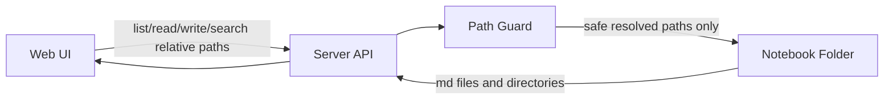

# feat: Build Markdown Web Notes MVP

## Overview

从空仓库开始实现一个自用 Web 笔记软件 MVP：服务端选择并挂载某个本地目录作为“笔记本根目录”，所有笔记以 `.md` 文件直接存储；前端提供类 Obsidian 的文件树、Markdown 编辑、预览、搜索和基础资源管理能力；编辑器优先采用 CodeMirror 6，保证 Markdown 原文可控、易迁移、可被外部编辑器继续使用。

---

## Problem Frame

用户希望拥有一个自托管、Web 形式、Markdown-first 的个人笔记系统：

- 笔记来源是部署服务器上的某个目录；
- 可以直接导入已有 Markdown 文件夹；
- 文件最终仍以 `.md` 格式存储，而不是私有数据库格式；
- 体验参考 Obsidian 的文件系统笔记本和思源笔记较顺手的文档编辑交互；
- MVP 阶段优先建立可靠的数据读写和可用编辑体验，不追求完整思源块模型。

当前仓库状态：空项目，尚无前后端代码、构建配置或测试体系。

---

## Requirements Trace

- R1. 服务端可以配置一个服务器目录作为笔记本根目录。
- R2. 支持读取、创建、编辑、保存、重命名、移动、删除 `.md` 文件和目录。
- R3. 支持直接使用已有 Markdown 文件夹作为笔记本来源。
- R4. 前端提供文件树、编辑器、预览和基础搜索。
- R5. Markdown 文件应尽量保持原文可控，不强制转换为私有格式。
- R6. 系统需要做路径安全校验，避免访问笔记本根目录之外的文件。
- R7. MVP 架构应便于后续扩展双链、反向链接、标签、图片粘贴、全文索引和登录权限。

---

## Scope Boundaries

MVP 明确不做：

- 不做完整思源式块数据库、块 ID、块引用和块级同步。
- 不做多用户协作编辑。
- 不做端到端加密。
- 不做移动端 App，只保证 Web 响应式基础可用。
- 不做复杂同步协议；服务器文件系统是唯一真相源。
- 不强依赖数据库保存笔记正文，正文必须直接落在 `.md` 文件中。
- 不在 MVP 阶段实现插件市场、主题市场或公开发布能力。

### Deferred to Follow-Up Work

- 双链 `[[页面]]`、反向链接、标签索引：MVP 文件读写稳定后实现。
- 图片粘贴、附件管理：基础编辑保存完成后实现。
- SQLite FTS5 全文索引：先用简单文件扫描或 ripgrep，后续替换为索引方案。
- 登录认证和外网安全部署：本地/内网自用 MVP 完成后再补强。

---

## Context & Research

### Relevant Code and Patterns

- 当前仓库为空，无既有代码模式可复用。
- 计划从标准 TypeScript Web 项目结构开始：`apps/server` + `apps/web` + `packages/shared`。

### Institutional Learnings

- 未发现 `docs/solutions/` 或已有项目经验文档。

### External References

- 本计划未进行外部实时文档检索；具体依赖版本在实现阶段安装时确认。

---

## Key Technical Decisions

- **编辑器选择 CodeMirror 6**：它以纯文本为核心，更适合 Markdown 原文存储，避免富文本编辑器重新序列化 Markdown 导致格式变化。
- **笔记正文只存文件系统**：服务端 API 对 `.md` 文件做读写，数据库只作为后续索引缓存可选项，不作为正文主存储。
- **单体仓库 + 前后端分离目录**：MVP 使用一个 repo 管理 Web 和 API，降低部署和开发复杂度。
- **服务端统一做路径归一化和越界校验**：所有文件操作必须先 resolve 到 notebook root 下，前端传入相对路径，不允许传绝对路径。
- **前端状态轻量化**：MVP 使用 TanStack Query 或等价请求缓存管理服务端状态，避免过早引入复杂全局状态。
- **搜索先简单后增强**：MVP 可先扫描 `.md` 文件内容满足自用，后续再引入 SQLite FTS5 或增量索引。

---

## Open Questions

### Resolved During Planning

- **Milkdown 还是 CodeMirror 6？** 选择 CodeMirror 6，因为当前产品目标是 Markdown-first 和文件原文可控。
- **是否需要私有文档格式？** MVP 不需要，统一使用 `.md` 文件。
- **是否需要完整块模型？** MVP 不做，后续可在 Markdown heading/paragraph 层面做轻量块交互。

### Deferred to Implementation

- **最终 UI 组件库选择**：可在实现时根据个人偏好选择 Shadcn UI、Naive UI、Ant Design 或纯 CSS。
- **搜索底层实现**：先实现简单搜索接口；如果文件数量较大，再替换为 ripgrep 或 SQLite FTS5。
- **编辑器增强插件边界**：先完成基础编辑保存，再逐步加入 slash command、双链补全、标题折叠等增强。

---

## Output Structure

```text
.
├── docs/
│   └── plans/
│       └── 2026-09-03-001-feat-md-web-notes-mvp-plan.md
├── apps/
│   ├── server/
│   │   ├── src/
│   │   │   ├── config/
│   │   │   ├── notebook/
│   │   │   ├── search/
│   │   │   └── main.ts
│   │   └── test/
│   └── web/
│       ├── src/
│       │   ├── app/
│       │   ├── components/
│       │   ├── features/
│       │   │   ├── editor/
│       │   │   ├── file-tree/
│       │   │   └── search/
│       │   └── main.tsx
│       └── test/
├── packages/
│   └── shared/
│       └── src/
├── package.json
├── pnpm-workspace.yaml
└── README.md
```

---

## High-Level Technical Design

> *This illustrates the intended approach and is directional guidance for review, not implementation specification. The implementing agent should treat it as context, not code to reproduce.*



核心数据流：

1. 配置 `NOTEBOOK_ROOT` 指向服务器上的笔记目录。
2. 前端只发送相对路径，例如 `daily/2026-09-03.md`。
3. 后端将相对路径与 `NOTEBOOK_ROOT` 组合并归一化。
4. 后端确认目标路径仍位于 `NOTEBOOK_ROOT` 内。
5. 通过校验后才允许读写、重命名、移动、删除和搜索。

---

## Implementation Units

- [x] U1. **Project scaffolding and baseline tooling**

**Goal:** 建立 TypeScript monorepo、前端、后端、共享类型和基础开发脚本。

**Requirements:** R4, R7

**Dependencies:** None

**Files:**
- Create: `package.json`
- Create: `pnpm-workspace.yaml`
- Create: `apps/server/package.json`
- Create: `apps/server/tsconfig.json`
- Create: `apps/server/src/main.ts`
- Create: `apps/web/package.json`
- Create: `apps/web/index.html`
- Create: `apps/web/src/main.tsx`
- Create: `packages/shared/package.json`
- Create: `packages/shared/src/index.ts`
- Test: `apps/server/test/smoke.test.ts`
- Test: `apps/web/test/smoke.test.tsx`

**Approach:**
- 使用 pnpm workspace 管理 `apps/server`、`apps/web`、`packages/shared`。
- 后端建议 Fastify 或 Hono，前端建议 React + Vite；也可等价替换为 Vue + Vite，但同一实现中应保持一致。
- 共享包只放 API DTO、路径类型和通用错误码，避免业务逻辑过早下沉。

**Patterns to follow:**
- 当前无既有模式；采用常见 TypeScript workspace 分层。

**Test scenarios:**
- Happy path: 启动后端健康检查入口，应返回可识别的 OK 状态。
- Happy path: 前端根组件渲染应用 shell，应出现文件树/编辑区占位布局。
- Error path: 缺少必要环境变量时，后端应给出明确错误信息或回退到安全默认配置。

**Verification:**
- 项目脚本可以安装依赖、类型检查并运行基础 smoke test。
- 前后端目录结构清晰，后续单元可以独立添加功能。

---

- [x] U2. **Notebook root configuration and path safety**

**Goal:** 实现笔记本根目录配置、路径归一化、越界防护和 Markdown 文件过滤规则。

**Requirements:** R1, R3, R5, R6

**Dependencies:** U1

**Files:**
- Create: `apps/server/src/config/notebook-config.ts`
- Create: `apps/server/src/notebook/notebook-path.ts`
- Create: `apps/server/src/notebook/notebook-errors.ts`
- Test: `apps/server/test/notebook-path.test.ts`

**Approach:**
- 从环境变量或本地配置读取 `NOTEBOOK_ROOT`。
- API 层只接受相对路径。
- 统一封装 `resolveNotebookPath` 类能力：拒绝空 root、绝对路径输入、`..` 越界、符号链接逃逸和非允许扩展名操作。
- 允许目录操作和 `.md` 文件操作；附件目录可预留但不在 MVP 深入。

**Patterns to follow:**
- 当前无既有模式；该模块应成为所有文件 API 的强制入口。

**Test scenarios:**
- Happy path: 输入 `notes/a.md`，应解析到 notebook root 内部路径。
- Edge case: 输入 `./notes//a.md`，应归一化为稳定相对路径。
- Error path: 输入 `../secret.md`，应被拒绝。
- Error path: 输入绝对路径，应被拒绝。
- Error path: 尝试访问非 Markdown 文件作为笔记正文，应被拒绝或按附件策略处理。
- Integration: 文件 API 使用该路径模块时，越界路径不能绕过校验。

**Verification:**
- 所有后端文件操作只能通过安全路径模块访问文件系统。
- 路径错误返回稳定错误码，前端可展示清晰提示。

---

- [x] U3. **File tree and Markdown CRUD API**

**Goal:** 提供目录树读取、Markdown 文件读取/保存、创建、重命名、移动和删除接口。

**Requirements:** R1, R2, R3, R5, R6

**Dependencies:** U2

**Files:**
- Create: `apps/server/src/notebook/notebook-service.ts`
- Create: `apps/server/src/notebook/notebook-routes.ts`
- Create: `packages/shared/src/notebook-contracts.ts`
- Test: `apps/server/test/notebook-service.test.ts`
- Test: `apps/server/test/notebook-routes.test.ts`

**Approach:**
- 文件树接口返回目录和 `.md` 文件节点，包含相对路径、名称、类型、更新时间等必要信息。
- 读文件接口返回 Markdown 原文。
- 保存接口覆盖写入文件内容，并可保留未来扩展 optimistic concurrency 的空间。
- 删除操作 MVP 可先做真实删除，但实现前需考虑是否移动到 `.trash`；若选择真实删除，应在 UI 上明确二次确认。
- 重命名和移动必须防止覆盖已有文件，除非后续显式加入覆盖策略。

**Patterns to follow:**
- 所有输入路径先走 `apps/server/src/notebook/notebook-path.ts`。
- DTO 类型统一从 `packages/shared/src/notebook-contracts.ts` 导出。

**Test scenarios:**
- Happy path: 已有 Markdown 文件夹作为 root 时，文件树能正确列出子目录和 `.md` 文件。
- Happy path: 读取 `a.md` 返回原始 Markdown 内容。
- Happy path: 保存 `a.md` 后，磁盘文件内容变为提交内容。
- Happy path: 创建新文件时自动写入空内容或模板内容。
- Edge case: 空目录返回空 children，而不是错误。
- Edge case: 文件名包含中文和空格时可以正常读写。
- Error path: 保存到不存在的父目录时返回明确错误。
- Error path: 重命名目标已存在时拒绝覆盖。
- Error path: 删除目录时若目录非空，按 MVP 策略拒绝或明确执行递归删除，不能行为含糊。
- Integration: API 路由层返回的错误码和 service 层错误保持一致。

**Verification:**
- 通过 API 可以完成基础笔记文件生命周期操作。
- 直接导入已有 Markdown 文件夹时无需迁移即可浏览和编辑。

---

- [x] U4. **Web app shell and file explorer**

**Goal:** 实现 Web 主界面布局、文件树浏览、当前文件选择和基础文件操作入口。

**Requirements:** R2, R3, R4

**Dependencies:** U3

**Files:**
- Create: `apps/web/src/app/App.tsx`
- Create: `apps/web/src/features/file-tree/FileTree.tsx`
- Create: `apps/web/src/features/file-tree/file-tree-api.ts`
- Create: `apps/web/src/features/file-tree/use-file-tree.ts`
- Create: `apps/web/src/features/file-tree/file-tree-types.ts`
- Test: `apps/web/test/file-tree.test.tsx`

**Approach:**
- 页面采用三栏基础布局：左侧文件树，中间编辑器，右侧预览/信息栏可先占位。
- 文件树从服务端拉取，支持点击 `.md` 文件设置当前文件。
- 新建、重命名、删除等入口先实现基础交互，危险操作需要确认。
- 状态管理保持简单：当前选中文件路径、文件树请求状态、错误提示。

**Patterns to follow:**
- API 类型从 `packages/shared` 引用。
- UI 组件保持业务语义命名，避免过早抽象通用组件库。

**Test scenarios:**
- Happy path: 文件树接口返回目录和文件时，界面按层级展示。
- Happy path: 点击 Markdown 文件后，当前文件路径状态更新。
- Edge case: 空笔记本目录时显示空状态和新建入口。
- Error path: 文件树加载失败时显示错误提示和重试入口。
- Integration: 新建文件成功后，文件树刷新并选中新文件。

**Verification:**
- 用户可以在浏览器中看到服务器笔记目录结构并选择笔记。
- UI 对空目录、加载中、错误状态都有明确表现。

---

- [x] U5. **CodeMirror Markdown editor and save flow**

**Goal:** 集成 CodeMirror 6，实现 Markdown 编辑、加载、脏状态提示和保存。

**Requirements:** R2, R4, R5

**Dependencies:** U3, U4

**Files:**
- Create: `apps/web/src/features/editor/MarkdownEditor.tsx`
- Create: `apps/web/src/features/editor/editor-api.ts`
- Create: `apps/web/src/features/editor/use-note-document.ts`
- Create: `apps/web/src/features/editor/editor-shortcuts.ts`
- Test: `apps/web/test/markdown-editor.test.tsx`
- Test: `apps/web/test/note-save-flow.test.tsx`

**Approach:**
- 选中文件后读取 Markdown 原文并填入 CodeMirror。
- 编辑内容后标记 dirty，支持手动保存和快捷键保存。
- 保存成功后清除 dirty 状态；保存失败时保留编辑内容并提示错误。
- MVP 可先提供纯编辑模式；实时预览在 U6 实现。
- 不在编辑器层重新格式化 Markdown。

**Patterns to follow:**
- CodeMirror 只作为文本编辑器，文件内容以字符串形式进出。
- 保存 API 复用 U3 的 Markdown CRUD contract。

**Test scenarios:**
- Happy path: 选择文件后，编辑器显示服务端返回的 Markdown 原文。
- Happy path: 修改内容并保存后，请求体包含完整 Markdown 字符串。
- Happy path: 保存成功后 dirty 状态清除。
- Edge case: 切换文件时若当前文件未保存，应提示用户确认或阻止切换。
- Error path: 保存失败时，编辑器内容不能丢失，并展示错误提示。
- Integration: 文件树选中路径变化会驱动编辑器加载对应文件。

**Verification:**
- 用户可以完成打开 Markdown、编辑、保存的核心闭环。
- Markdown 内容不会被编辑器自动转换成其他格式。

---

- [x] U6. **Markdown preview and simple search**

**Goal:** 增加 Markdown 预览和基础搜索能力，让 MVP 达到日常记笔记可用状态。

**Requirements:** R4, R5, R7

**Dependencies:** U3, U5

**Files:**
- Create: `apps/web/src/features/editor/MarkdownPreview.tsx`
- Create: `apps/web/src/features/search/SearchPanel.tsx`
- Create: `apps/web/src/features/search/search-api.ts`
- Create: `apps/server/src/search/search-service.ts`
- Create: `apps/server/src/search/search-routes.ts`
- Modify: `apps/server/src/main.ts`
- Test: `apps/web/test/markdown-preview.test.tsx`
- Test: `apps/web/test/search-panel.test.tsx`
- Test: `apps/server/test/search-service.test.ts`

**Approach:**
- 预览使用 Markdown 渲染库将当前编辑内容渲染为 HTML，并做基础 XSS 防护。
- MVP 搜索可以先遍历 `.md` 文件并匹配关键词，返回文件路径、标题/片段和匹配位置。
- 搜索服务必须复用路径和扩展名规则，不扫描 notebook root 外部内容。
- UI 上支持输入关键词、展示结果、点击结果打开对应文件。

**Patterns to follow:**
- 后端搜索仍以 `notebook-path` 和 `notebook-service` 的文件枚举能力为基础。
- 前端搜索结果点击行为复用文件选择流程。

**Test scenarios:**
- Happy path: Markdown 标题、列表、代码块能在预览中正确显示。
- Happy path: 搜索关键词命中多个文件时，返回所有匹配文件和片段。
- Happy path: 点击搜索结果后打开对应 Markdown 文件。
- Edge case: 空关键词不触发全盘搜索或返回明确空状态。
- Edge case: 大小写匹配策略保持一致并在 UI 上可预期。
- Error path: Markdown 中包含危险 HTML 时，预览不应执行脚本。
- Error path: 搜索过程中遇到不可读文件时，应跳过并返回部分结果或明确错误策略。
- Integration: 编辑保存后的内容应能被后续搜索命中。

**Verification:**
- 用户可以边写边看预览，并能通过关键词找回已有笔记。
- 搜索不会越过配置的笔记本根目录。

---

- [x] U7. **Local deployment and notebook import workflow**

**Goal:** 提供自托管运行说明、环境变量配置、Docker/本地运行方式和已有 Markdown 文件夹接入流程。

**Requirements:** R1, R3, R6, R7

**Dependencies:** U1, U2, U3, U4, U5, U6

**Files:**
- Create: `README.md`
- Create: `.env.example`
- Create: `Dockerfile`
- Create: `docker-compose.yml`
- Create: `docs/usage/import-existing-folder.md`
- Test: `apps/server/test/config.test.ts`

**Approach:**
- `.env.example` 明确 `NOTEBOOK_ROOT` 配置方式。
- Docker Compose 使用 volume 挂载宿主机笔记目录到容器内固定路径。
- README 给出本地开发、生产构建、指定笔记目录和导入已有文件夹的方法。
- 文档强调路径权限、备份和删除操作风险。

**Patterns to follow:**
- 配置读取逻辑复用 U2。
- 文档只描述 MVP 已实现能力，不承诺后续功能已经可用。

**Test scenarios:**
- Happy path: 设置有效 `NOTEBOOK_ROOT` 时，服务端配置加载成功。
- Error path: `NOTEBOOK_ROOT` 不存在或不可读时，服务端给出明确错误。
- Error path: `NOTEBOOK_ROOT` 指向普通文件而非目录时，应拒绝启动或拒绝加载。
- Integration: Docker volume 挂载路径与服务端配置路径一致。

**Verification:**
- 用户可以按照 README 将已有 Markdown 文件夹作为笔记本打开。
- 部署配置不会默认访问项目目录外的未知路径。

---

## System-Wide Impact

- **Interaction graph:** Web UI 通过 HTTP API 操作服务端，服务端唯一接触文件系统；所有文件操作必须经过路径安全模块。
- **Error propagation:** 后端返回稳定错误码和用户可读消息；前端将错误展示在对应文件树、编辑器或搜索区域。
- **State lifecycle risks:** 编辑器 dirty 状态、文件切换、保存失败、删除/重命名后的当前文件状态需要重点处理，避免内容丢失。
- **API surface parity:** 文件路径 contract 需要在前端、后端、共享类型中保持一致。
- **Integration coverage:** 需要覆盖“文件树选择 -> 读取 -> 编辑 -> 保存 -> 搜索命中”的跨层主流程。
- **Unchanged invariants:** Markdown 正文不进入私有数据库；已有文件夹无需迁移即可使用。

---

## Risks & Dependencies

| Risk | Mitigation |
|------|------------|
| 路径穿越导致读取服务器敏感文件 | 所有 API 只接受相对路径，后端统一 resolve 并校验 root 边界 |
| 编辑器切换文件导致未保存内容丢失 | 引入 dirty 状态和切换确认 |
| Markdown 被自动格式化影响外部兼容 | 选择 CodeMirror 6，保存字符串原文，不做自动格式化 |
| 删除操作误删真实笔记 | MVP UI 二次确认；后续可改为 `.trash` 软删除 |
| 大笔记库搜索变慢 | MVP 简单搜索；后续替换 ripgrep 或 SQLite FTS5 |
| 外网部署缺少认证 | MVP 默认定位本地/内网自用；外网前必须补登录、HTTPS、反代安全配置 |

---

## Documentation / Operational Notes

- README 必须说明：这是 Markdown-first 工具，直接操作真实文件夹，使用前建议备份。
- 导入已有文件夹本质是配置 `NOTEBOOK_ROOT` 指向该目录，不需要复制或转换。
- 如果 Docker 部署，必须清楚说明宿主机目录和容器目录的挂载关系。
- 删除、移动、重命名会影响真实文件；MVP 应在 UI 和文档中提醒。

---

## Success Metrics

- 能在 Web 中打开已有 Markdown 文件夹。
- 能浏览目录树并打开任意 `.md` 文件。
- 能编辑并保存 Markdown，磁盘文件实际更新。
- 能创建、重命名、移动、删除基础笔记文件。
- 能预览当前 Markdown 内容。
- 能通过关键词搜索已有笔记。
- 核心文件 API 具备路径越界防护测试。

---

## Future Considerations

- 双链补全：输入 `[[` 时从文件树/标题索引中提示页面。
- 反向链接：解析 Markdown 内容中的 wiki link 和标准 Markdown link，建立缓存索引。
- 标签系统：解析 `#tag` 和 frontmatter tags。
- 图片粘贴：粘贴图片到附件目录，并自动插入 Markdown 图片链接。
- 轻量块交互：基于段落/标题位置实现块选择、拖拽和引用，不引入私有正文格式。
- Git 集成：可选地支持笔记目录提交历史和版本回滚。

---

## Sources & References

- User request: 当前对话中关于 Markdown Web 笔记软件、服务器目录作为笔记本来源、CodeMirror 6 编辑器选择的需求说明。
- Related plan file: `docs/plans/2026-09-03-001-feat-md-web-notes-mvp-plan.md`
